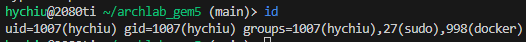

# archlab_gem5

## git
- clone repo
    `git clone https://git.dataarch.myds.me/hychiu/archlab_gem5.git`
- Enter repo directory
    `cd archlab_gem5`
- create your branch
    `git checkout -b {your_branch_name}`
- push your branch
    `git add .`
    `git commit -m "your commit info"`
    `git push --set-upstream origin {your_branch_name}`
    -  `git add {Edited file you want to add}`
    -  `git commit -m "your commit info"`
    -  `git push --set-upstream origin {your_branch_name}`

## Docker
- Change Dockerfile
    ```Dockerfile=
    ARG UID={YOUR_UID}
    ARG GID={YOUR_GID}
    ```
    to your uid and gid
    - Using `id` to get your uid & gid
    
- Build docker image
    ```
    docker build -t {your_image_tag} . --no-cache
    ```
- Run a gem5 container
    ```
    docker run -it --name {your_container_name} -v {path_you_want_to_mount}:/home/docker/workspace {your_image_tag}
    ```

## gem5
- `mkdir lab1/log`
- `cd gem5`
- build gem5 binary
    ```
    scons build/NULL/gem5.opt -j$(nproc)
    ```
    Replace `$(nproc)` to your desired number of cores to build, or using `$(nproc)` to build with all cores
- run gem5 binary & save log
    ```
    build/NULL/gem5.opt -d ../lab1/m5out --debug-flags {your_simple_pe_debug_flags},CacheAll,XBar,DRAM configs/archlab/lab1/arch_config.py > ../lab1/log/config.log
    ```
    Replace `{your_simple_pe_debug_flags}` to your debug flag
