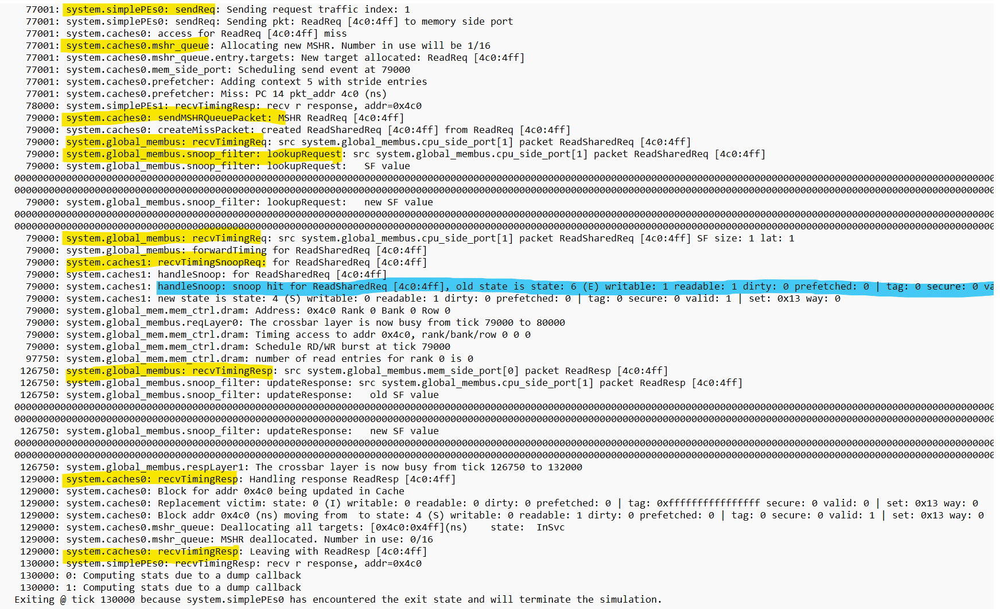
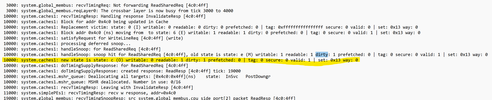

# Gem5 Lab2

## Scenario1 - Hit on another cache, not dirty
- describe traffic assigned to simulate 

    - 先讓 PE1 去讀取 address 1234 值，等到 PE1 讀取完後 (透過讓 PE0 delay 77000)，再讓 PE0 去讀取 address 1234

- config script
```c++=
    system.simplePEs[1].addTraffic(1234, 0)     # read
    system.simplePEs[0].addTraffic(77000, 2)    # delay
    system.simplePEs[0].addTraffic(1234, 0)     # read
```
- Highlight the request & resopnse flow from log

    

## Scenario2 - Hit on another cache, dirty
- describe traffic assigned to simulate
    
    - 透過先讓 PE1 寫入 address 1234，之後再讓 PE0 去讀 address 1234 的值

- config script
```c++=
    system.simplePEs[1].addTraffic(1234, 1)     # write
    system.simplePEs[0].addTraffic(1234, 2)     # delay
    system.simplePEs[0].addTraffic(1234, 0)     # read
```
- Highlight the request & resopnse flow from log

    
