# Gem5 Lab2

## Screenshots of hardware configuration result 

### private_l1_private_l2_cache_hierarchy
* using two cores
* single_tile

    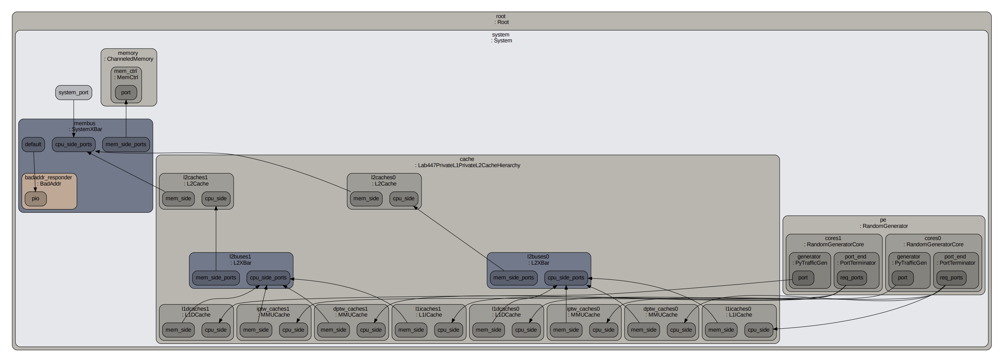

* multi_tile
 

    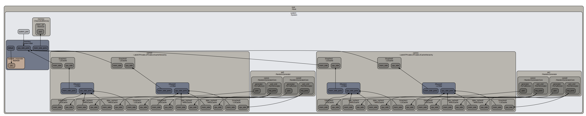

### private_l1_shared_l2_cache_hierarchy 
* using two cores
* single_tile

    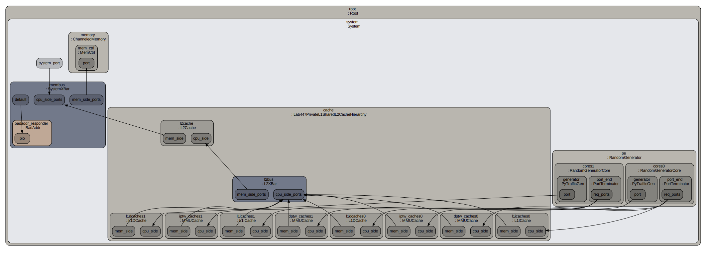

* multi_tile

    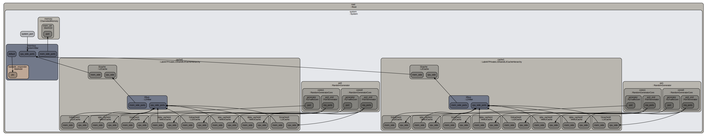

## Screenshots of stats, anything that could prove it works 

### private_l1_private_l2_cache_hierarchy

* single_tile

    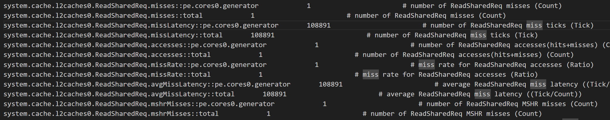

* multi_tile

    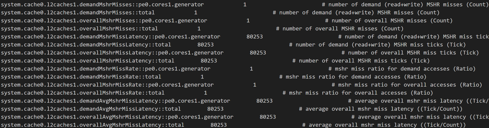

### private_l1_shared_l2_cache_hierarchy 

* single_tile

    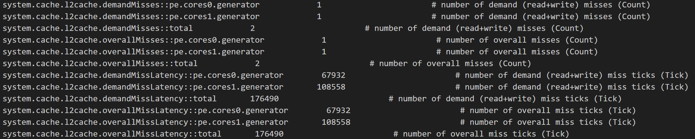

* multi_tile

    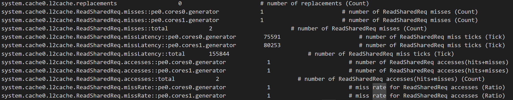

## Brief description of your implementation of function

### schematic diagram

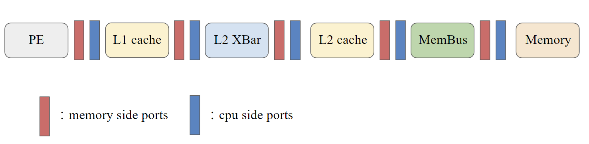

### private_l1_private_l2_cache_hierarchy
* each L1 cache corresponds to its own L2 cache

* define components
 

  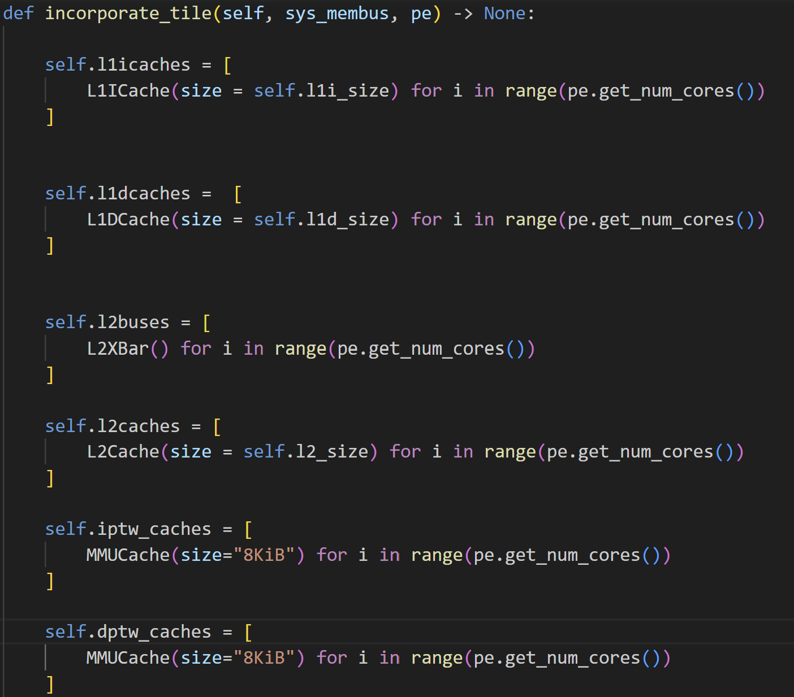

* wiring
 

  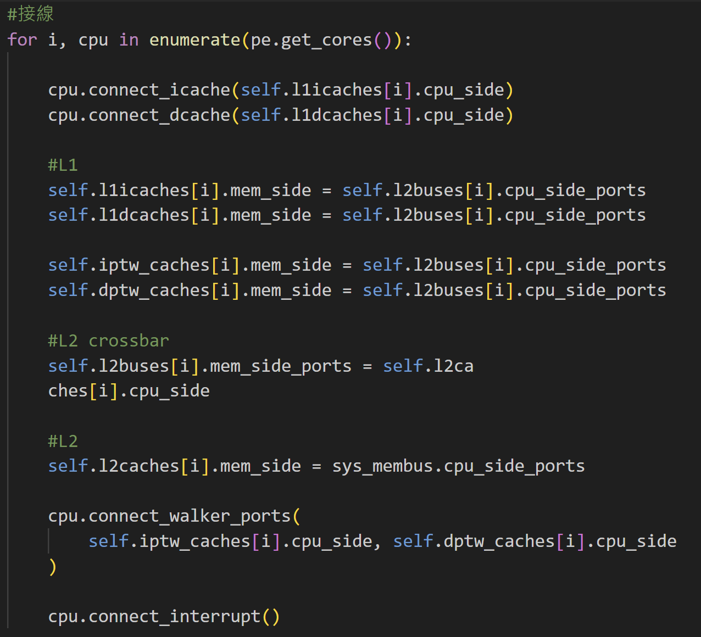

### private_l1_shared_l2_cache_hierarchy 
* each L1 cache corresponds to same L2 cache

* define components
 

  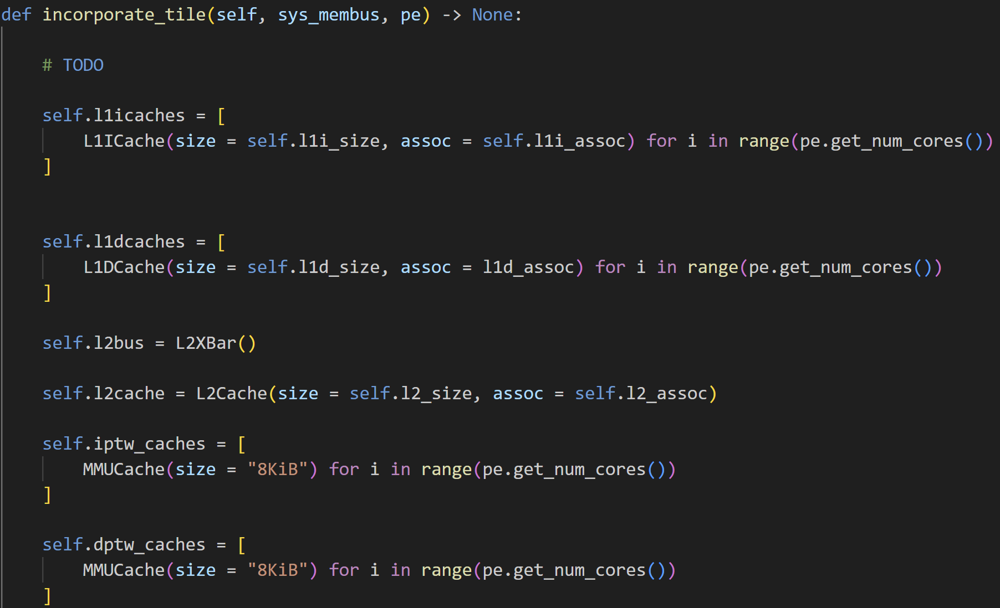

* wiring
 

   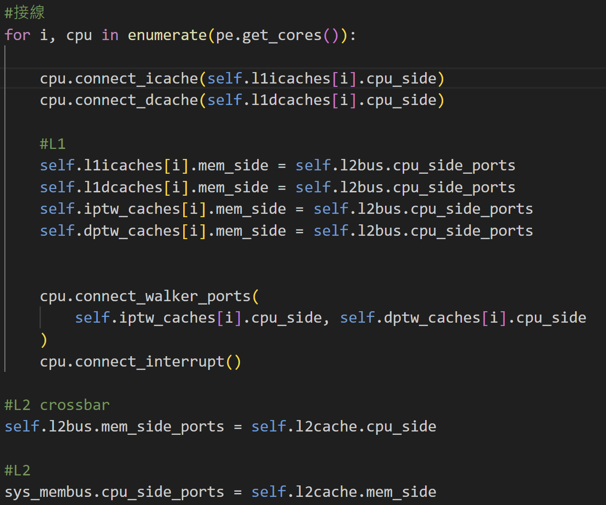
